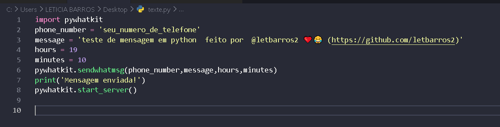

# WhatsApp Message Automation with PyWhatKit



## Descrição

Este projeto utiliza a biblioteca `pywhatkit` para automatizar o envio de mensagens no WhatsApp. É uma maneira prática e divertida de enviar mensagens programadas diretamente do seu código Python.

## Funcionalidades

- Envio de mensagens programadas no WhatsApp
- Personalização de horário e mensagem
- Fácil de usar e configurar

## Pré-requisitos

Antes de começar, certifique-se de ter o seguinte instalado:

- Python 3.x
- Biblioteca `pywhatkit`

## Instalação

1. Clone este repositório:

    ```bash
    git clone https://github.com/letbarros2/whatsapp-python.git
    ```

2. Navegue até o diretório do projeto:

    ```bash
    cd whatsapp-python
    ```

3. Instale as dependências:

    ```bash
    pip install pywhatkit
    ```

## Uso

Para utilizar o script, edite o código conforme necessário:

```python
import pywhatkit

phone_number = 'seu_numero_de_telefone'
message = 'teste de mensagem em python feito por @letbarros2 ❤️😂 (https://github.com/letbarros2)'
hours = 19
minutes = 10

pywhatkit.sendwhatmsg(phone_number, message, hours, minutes)
print('Mensagem enviada!')
pywhatkit.start_server()
